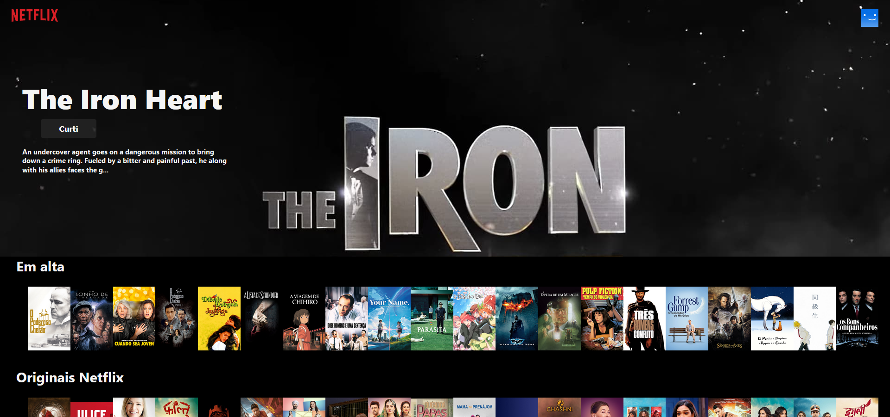

# Projeto 2 - Tecnologias Web 

## Aluna : Ana Laiz Novais De Farias 
## Professora : Barbara Agena 

# Introdução 

Como escopo do projeto 2 de Tecweb o tema escolhido foi fazer uma copia do layout inicial da Netflix.

# O projeto possui as seguintes funcionalidades: 

- Mostra o filmes na tela separados por categorias.
- Tem um destataque no qual a cada vez que a página é atualizada ele troca o filme
- No destaque existe um botão de curti onde ele guarda na API todos os filmes curtidos no destaque

- A quarta e última funcionalidade, quando você clica nos filmes da categoria ele mostra o trailer do respectivo filme, essa funcionalidade foi possivel atraves da utilização de uma sub-biblioteca do React js, o ReactPlayer.

# Observação não foi possivel fazer o deploy, pois o Railway não deixa carregar o backend. Mas segue em anexo o link para o git, onde você verá os commits onde eu tentei fazer o deploy. 

https://github.com/LaizFarias/tecwebProjeto2Backend

# Referências usadas nesse trabalho 

- https://www.youtube.com/watch?v=-9ulftO_zZU
- https://www.youtube.com/watch?v=GGBzMpIAgz4
- https://github.github.io/fetch/
- https://www.django-rest-framework.org/tutorial/quickstart/
- https://legacy.reactjs.org/docs/handling-events.html 
- https://scrimba.com/playlist/pYLJYUJ

